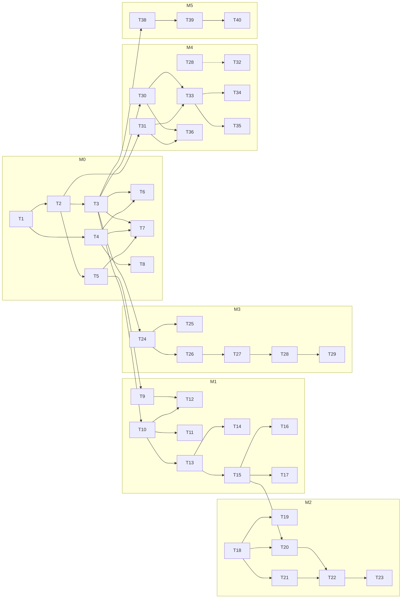

# Execution Plan — TenderCraft

## §A Plan header

| Field | Value |
|---|---|
| Status | approved (2026-07-24T00:00:00Z) |
| PRD | tendercraft-PRD.md (product) + docs/PRD.md (execution wrapper) · shape: foreign (DERIVED milestones blessed at scaffold) · sha256: 915d25d1 |
| Planner | project-planning-orchestrator v1.0.0 · session model: fable (claude-fable-5) |
| Probe | scaffolded: Y · prd-to-ship: Y · devfleet: N (groups advisory) · tiers available: fable/opus/sonnet/haiku (ASSUMED all four — reroute at Gate P if your plan lacks one) |
| Design spec | docs/DESIGN_SPEC.md · status: approved · sha matches PRD ✓ |
| Mode | fresh |

## §B Objective & success criteria

**Objective (restated):** Convert Indian tender packages (GeM/CPPP/state) into a locked, source-anchored Tender Object Model; decide eligibility with deterministic gates and a conservative Bid/No-Bid; generate cited, compliant proposal drafts behind approval + export gates. AI reads and writes; deterministic logic decides; humans approve everything that leaves.

**Success criteria:** module AC tables (A-AC1–5, B-AC1–5, C-AC1–5, D-AC1–5, E-AC1–4) · first draft ≤2h p90 · eligibility FPR <5% · zero uncited claims at export.
**Top non-goals guarding this plan:** portal write integration / autonomous submission (G-1) · credential fabrication (G-7) · cross-client training without opt-in.

## §C Architecture & decisions

**LOCKED (docs/PRD.md §4 — constraints, not choices):** Next.js 15 `apps/web` + FastAPI `services/engine` · Supabase Postgres + RLS + pgvector · Claude API (sonnet extract/draft, haiku classify) · response envelope `{ok,data,error{code,message}}` · design tokens binding.

**DELEGATED decisions made by this plan** (→ PRD Appendix B on approval):

| # | Decision | Choice | Rationale (one line) | Plan impact |
|---|---|---|---|---|
| D1 | Background jobs | FastAPI BackgroundTasks + `jobs` table (queue later if volume demands) | PH1 volume is design-partner scale; a queue is speculative | T10/T12 shape; no queue infra tasks |
| D2 | Auth | Supabase Auth (email+password), JWT validated in engine middleware | Already the scaffold assumption; SSO is PH3 | T3 wiring; T30 builds RBAC on top |
| D3 | Retrieval | Hybrid = Postgres tsvector + pgvector, tenant-filtered before ranking | PRD names hybrid lexical+semantic; one DB, no extra infra | T26; isolation tests extend to retrieval |
| D4 | DOCX/PDF rendering | python-docx + WeasyPrint in engine, template packs as data | Deterministic renderers must be code we own, not model output | T34 |

**Deliberately still delegated to build time:** OCR provider (spike T9 answers it — PRD TODO requires accuracy evidence, not a guess) · notification channel for T-24h SMS (email+in-app first).

## §D Milestone & task plan

Milestones from docs/PRD.md §5 (derived from PRD PH0–PH3, blessed at scaffold). Milestones serial; groups within milestones advisory (no devfleet).

### M0 — Walking skeleton
**Exit criteria:** all CLAUDE.md commands green · S2-D2 · demoable: sign in as FIX-1, see empty dashboard, engine /health responds.

| ID | Task | ACs | cx | Tier | Layers | Depends | Files touched | Tests added | Lvl | Grp | Type | Design |
|----|------|-----|----|------|--------|---------|---------------|-------------|-----|-----|------|--------|
| T1 | Monorepo init: pnpm workspace, Next+TS+Tailwind+shadcn, FastAPI+uv, all commands runnable | enabler→all | med | sonnet | unit | — | apps/web/, services/engine/, package.json | smoke tests | 0 | — | enabler | — |
| T2 | Supabase schema v0 + RLS on every table + CI isolation-test harness | ET-6 | high | opus | integration | T1 | services/engine/migrations/, tests/isolation/ | test_isolation.py | 1 | — | enabler | — |
| T3 | Auth: Supabase Auth in web, JWT middleware + envelope/error taxonomy in engine | ET-6 | high | opus | integration, verify-api | T2 | apps/web/lib/auth/, services/engine/app/middleware/ | test_auth.py | 2 | — | enabler | — |
| T4 | Design-system enabler: tokens→Tailwind theme, C1–C6 components, format helpers | GLB-D1..3 | med | sonnet | unit, design-review | T1 | apps/web/tailwind.config.ts, components/design/, lib/format.ts | format.test.ts, C-component tests | 1 | — | enabler | C1–C6 |
| T5 | Seed + fixtures FIX-1..5 (idempotent `pnpm seed`) | §10 | low | haiku | unit | T2 | fixtures/, scripts/seed.ts | seed smoke | 2 | — | enabler | — |
| T6 | S1 login screen + auth error state | S1-D1..2 | med | sonnet | browser-verify, design-review | T3, T4 | apps/web/app/(auth)/login/ | login.test.tsx | 3 | A | feature | S1 |
| T7 | S2 dashboard shell + empty state + KPI skeletons | S2-D2 | med | sonnet | browser-verify, design-review | T3, T4, T5 | apps/web/app/(app)/dashboard/ | dashboard.test.tsx | 3 | A | feature | S2 |
| T8 | S13 error boundary + 404 + EC-6 degraded card | S13-D1, EC-6 | med | sonnet | browser-verify, design-review | T4 | apps/web/app/error.tsx, not-found.tsx | error.test.tsx | 3 | A | feature | S13 |

### M1 — Module A: ingestion → locked TOM
**Exit criteria:** A-AC3, A-AC5 (deterministic gates) · extractor eval harness live · S4-D1 · demoable: upload FIX-3 fixture → verify queue → lock TOM.

| ID | Task | ACs | cx | Tier | Layers | Depends | Files touched | Tests added | Lvl | Grp | Type | Design |
|----|------|-----|----|------|--------|---------|---------------|-------------|-----|-----|------|--------|
| T9 | SPIKE: OCR provider eval on FIX-3 scans — answers: (1) which provider ≥98% word-accuracy estimation on Indian tender scans? (2) cost/page + latency inside A-AC4? | A-FR6 | med | sonnet | manual | T5 | docs/spikes/ocr.md | — | 0 | — | spike | — |
| T10 | Upload backend: storage, POST /api/tenders, jobs table, page-level status | A-FR1, A-AC4 | med | sonnet | integration, verify-api | T3 | services/engine/app/tenders/, apps/web/app/api/ | test_upload.py | 1 | — | feature | — |
| T11 | S3 upload screen incl. EC-1/EC-7 states | S3-D1..2, EC-1, EC-7 | med | sonnet | browser-verify, design-review | T10, T4 | apps/web/app/(app)/tenders/upload/ | upload.test.tsx | 2 | — | feature | S3 |
| T12 | OCR integration + ≥98% quality gate (EC-1 routing) | A-FR6 | med | sonnet | integration, verify-api | T9, T10 | services/engine/app/ocr/ | test_ocr_gate.py | 2 | — | feature | — |
| T13 | Extractor component: client.py (retry 1, timeout, cost log), prompt authoring, allowlisted schema (G-6), confidence→queue routing | A-FR2, A-AC3, G-6 | high | opus | unit, evals | T10 | services/engine/pipeline/extractor.py, client.py, prompts/extractor.md | test_extractor.py | 1 | — | feature | — |
| T14 | Wire extractor evals: run.py invokes real component, fault-injection live | A-AC1..2 harness | med | sonnet | evals | T13 | services/engine/evals/run.py | — | 2 | — | enabler | — |
| T15 | Verification queue backend: criteria CRUD, corrigendum diffs (A-FR3), deterministic lock gate (A-AC5) + audit events | A-AC5, A-FR3..5, EC-2 | high | opus | unit, integration, verify-api | T13 | services/engine/app/criteria/, app/deterministic/lock.py | test_lock_gate.py | 2 | — | feature | — |
| T16 | S4 verification queue screen (3-pane, ambiguity banner) | S4-D1..3 | med | sonnet | browser-verify, design-review | T15, T4 | apps/web/app/(app)/tenders/[id]/verify/ | verify.test.tsx | 3 | — | feature | S4 |
| T17 | S5 TOM detail screen (corrigendum diff, annexure inventory, handoffs) | S5-D1..2 | med | sonnet | browser-verify, design-review | T15, T4 | apps/web/app/(app)/tenders/[id]/ | tender-detail.test.tsx | 3 | — | feature | S5 |

### M2 — Module C: analyzer & eligibility engine
**Exit criteria:** C-AC4, C-AC5 (deterministic) · S7-D1..3 · demoable: FIX-2 profile vs FIX-3 TOM → NO-BID with quantified gaps.

| ID | Task | ACs | cx | Tier | Layers | Depends | Files touched | Tests added | Lvl | Grp | Type | Design |
|----|------|-----|----|------|--------|---------|---------------|-------------|-----|-----|------|--------|
| T18 | Vendor profile backend: schema, structured fields, completeness computation | C profile | med | sonnet | integration, verify-api | T3 | services/engine/app/profile/ | test_profile.py | 0 | — | feature | — |
| T19 | S6 profile screen (guided sections, expiry chips) | S6-D1..2 | med | sonnet | browser-verify, design-review | T18, T4 | apps/web/app/(app)/profile/ | profile.test.tsx | 1 | — | feature | S6 |
| T20 | Eligibility engine: criterion router, deterministic comparators (FY normalization), exemption overlays (C-FR3), gates-not-weights (C-FR5), rationale+source validator (C-AC4) | C-FR1/3/5, C-AC4 | high | opus | unit, integration, verify-api | T15, T18 | services/engine/app/deterministic/eligibility.py | test_comparators.py (100% branch) | 1 | — | feature | — |
| T21 | Eligibility matcher component: prompt, conservative default, 0.75 router (C-AC5) + evals wiring | C-FR2, C-AC5, ET-1 | high | opus | unit, evals | T18 | services/engine/pipeline/matcher.py, prompts/eligibility-matcher.md | test_matcher_routing.py | 1 | — | feature | — |
| T22 | Gap analysis + Bid/No-Bid recommendation (quantified shortfalls, conservative cap, manual re-check requests ET-2) | C-FR4, ET-2 | med | sonnet | unit, verify-api | T20, T21 | services/engine/app/analysis/ | test_gaps.py | 2 | — | feature | — |
| T23 | S7 analysis dashboard (anchor screen) | S7-D1..3 | med | sonnet | browser-verify, design-review | T22, T4 | apps/web/app/(app)/tenders/[id]/analysis/ | analysis.test.tsx | 3 | — | feature | S7 |

### M3 — Module B: generator core
**Exit criteria:** B-FR1/2/3 enforced end-to-end · citation validator green · S9-D1..3 · demoable: generate draft from locked TOM, trace a claim to its source in one click.

| ID | Task | ACs | cx | Tier | Layers | Depends | Files touched | Tests added | Lvl | Grp | Type | Design |
|----|------|-----|----|------|--------|---------|---------------|-------------|-----|-----|------|--------|
| T24 | Content library backend: upload, auto-classification (haiku call + human confirm), validity tracking, structured fields, provenance | §6 library, B-AC3 dep | med | sonnet | integration, verify-api | T3 | services/engine/app/library/ | test_library.py | 0 | — | feature | — |
| T25 | S8 library screen (expiry banner, classification confirm, provenance panel) | S8-D1..2 | med | sonnet | browser-verify, design-review | T24, T4 | apps/web/app/(app)/library/ | library.test.tsx | 1 | — | feature | S8 |
| T26 | Retrieval: chunking, hybrid tsvector+pgvector, validity hard-filter, tenant-scoped (isolation tests extended) | ET-6, §5.1 Retriever | high | opus | unit, integration | T24 | services/engine/pipeline/retriever.py | test_retrieval_isolation.py | 1 | — | feature | — |
| T27 | Drafter component: prompt, cite-or-flag markers, transclusion tokens (B-FR3), placeholder templates (B-FR2) + deterministic citation validator (B-AC3) + evals | B-FR1..3, B-AC3 | high | opus | unit, evals | T26 | services/engine/pipeline/drafter.py, prompts/drafter.md, evals/drafter/ | test_citation_validator.py | 2 | — | feature | — |
| T28 | Proposal assembly: sections, coverage counting (B-AC2 deterministic), watermark states (B-FR4), anchored comments (E-FR2 basic) | B-AC2, B-FR4 | med | sonnet | unit, integration, verify-api | T27 | services/engine/app/proposals/ | test_coverage.py | 3 | — | feature | — |
| T29 | S9 review workspace (editor, flags, placeholders, evidence panel, comments) | S9-D1..3 | med | sonnet | browser-verify, design-review | T28, T4 | apps/web/app/(app)/proposals/[id]/ | workspace.test.tsx | 4 | — | feature | S9 |

### M4 — Module E + export
**Exit criteria:** E-AC2, B-AC4 (hard gates) · E-AC1/E-AC3 · S10-D1..3 · demoable: blocked export with named blockers; clean export produces linted DOCX+PDF.

| ID | Task | ACs | cx | Tier | Layers | Depends | Files touched | Tests added | Lvl | Grp | Type | Design |
|----|------|-----|----|------|--------|---------|---------------|-------------|-----|-----|------|--------|
| T30 | RBAC roles + configurable approval chains (E-FR1) | E-FR1 | high | opus | integration, verify-api | T3 | services/engine/app/workspace/ | test_rbac.py | 0 | — | feature | — |
| T31 | Immutable audit trail: complete event coverage + audit-completeness test suite (E-AC1) | E-AC1, E-FR4 | high | opus | unit, integration | T2 | services/engine/app/audit/ | test_audit_completeness.py | 0 | — | feature | — |
| T32 | Version control: section versions, diffs, byte-identical restore (E-AC3) | E-AC3, E-FR3 | med | sonnet | unit, integration | T28 | services/engine/app/versions/ | test_restore.py | 1 | — | feature | — |
| T33 | Export gate: compliance matrix (deterministic), blockers (B-AC4/E-AC2), logged admin override, watermark removal + audit (B-FR4) | B-AC4, E-AC2 | high | opus | unit, integration, verify-api | T28, T30, T31 | services/engine/app/deterministic/export_gate.py | test_export_gate.py (100% branch) | 1 | — | feature | — |
| T34 | Deterministic renderers: DOCX/PDF (python-docx/WeasyPrint), GeM/CPPP template packs, template linter (B-AC5), portal-assist view (B-FR6, EC-4) | B-AC5, B-FR6 | med | sonnet | unit, integration | T33 | services/engine/app/render/ | test_template_linter.py | 2 | B | feature | — |
| T35 | S10 export & compliance gate screen | S10-D1..3 | med | sonnet | browser-verify, design-review | T33, T4 | apps/web/app/(app)/proposals/[id]/export/ | export.test.tsx | 2 | B | feature | S10 |
| T36 | S12 settings screen (roles, chain builder, audit log, deadline config) | S12-D1..2 | med | sonnet | browser-verify, design-review | T30, T31, T4 | apps/web/app/(app)/settings/ | settings.test.tsx | 2 | B | feature | S12 |
| T37 | Deadline governance: SLA timers, T-72/48/24 escalations (E-AC4), notifications, dashboard SLA chips (S2-D1) | E-AC4, E-FR6, S2-D1 | med | sonnet | unit, integration, browser-verify | T2 | services/engine/app/deadlines/, apps/web dashboard | test_escalations.py | 1 | — | feature | S2 |

### M5 — Module D: score estimator (data-gated)
**Exit criteria:** D-AC4 (suppression), D-AC5 · S11-D1..3 · demoable: estimate renders as range; low-data cluster suppresses honestly.

| ID | Task | ACs | cx | Tier | Layers | Depends | Files touched | Tests added | Lvl | Grp | Type | Design |
|----|------|-----|----|------|--------|---------|---------------|-------------|-----|-----|------|--------|
| T38 | Outcome logging + corpus tables (win/loss/stage/scores, D-FR4) | D-FR4 | med | sonnet | integration, verify-api | T3 | services/engine/app/outcomes/ | test_outcomes.py | 0 | — | feature | — |
| T39 | Score model v0: criterion features, calibrated range output (D-FR1), deterministic suppression gate (D-AC4), per-criterion attribution (D-AC5), weak-section ranking (D-FR3) | D-AC4..5, D-FR1..3 | high | opus | unit, evals | T38 | services/engine/pipeline/score.py | test_suppression.py (100% branch) | 1 | — | feature | — |
| T40 | S11 score estimate screen (range band, suppression state) | S11-D1..3 | med | sonnet | browser-verify, design-review | T39, T4 | apps/web/app/(app)/proposals/[id]/score/ | score.test.tsx | 2 | — | feature | S11 |

## §E Dependency graph



**Critical path:** T1→T2→T3→T10→T13→T15→T20→T22→T27→T33 (10 tasks through the deterministic spine) · **Parallel groups (advisory — no devfleet):** A: T6,T7,T8 (M0 screens) · B: T34,T35,T36 (M4 post-gate). Independence verified against prd-to-ship `parallel-heuristic.md` (disjoint files/tests/routes; shared config = dependent; conservative bias — all other candidates were pairs or shared seams).

## §F Model routing

| Tier | Model | Tasks | Count |
|------|-------|-------|-------|
| Orchestrator | fable (session) | oversight points §H.3, escalations, post-merge review | — |
| High | opus | T2, T3, T13, T15, T20, T21, T26, T27, T30, T31, T33, T39 | 12 |
| Standard | sonnet | T1, T4, T6–T12, T14, T16–T19, T22–T25, T28, T29, T32, T34–T38, T40 | 27 |
| Mechanical | haiku | T5 | 1 |

**Deviations from complexity defaults:** none — all high-tier assignments are high-floor hits (tenant isolation T2/T26, auth T3/T30, deterministic gates T15/T20/T33/T39, audit T31, AI components with eval thresholds T13/T21/T27).
**High-floor promotions applied:** T13, T21, T27, T39 (prompt/model code with eval thresholds) · T2, T26 (tenant isolation) · T3, T30 (authn/authz) · T31 (immutable audit) · T15, T20, T33 (deterministic gates = the product's safety story).
**Design floor applied:** every S-screen task (T6–T8, T11, T16, T17, T19, T23, T25, T29, T35, T36, T40) floors at med with `design-review` layer.
**Tier collapses:** none assumed — if your plan lacks opus or haiku, say so at Gate P (collapse table: opus→fable-supervised sonnet; haiku→sonnet).
**Impl agents:** `.claude/agents/impl-{low,med,high}.md` written (add-only).
**Skill preload suggestion (§3a):** add `frontend-design` (or `design-taste-frontend`) to impl-med/impl-high `skills:` frontmatter for design_ref tasks — left unapplied; approve to apply.
**Merge note for scaffold agents (proposals only — not applied):** `code-reviewer.md` → `model: opus` when reviewing cx:high diffs · verifier agents fine at default.
**Build session:** run `/prd-to-ship` on `fable` (or strongest available). `CLAUDE_CODE_SUBAGENT_MODEL` is unset ✓ — keep it that way for routed builds.

## §G Risk register & spikes

| # | Risk | L×I | Mitigation | Owner tier | Linked tasks |
|---|------|-----|------------|-----------|--------------|
| R1 | Extraction accuracy on scanned state-portal tenders misses A-AC1 on real corpus | H×H | verification queue absorbs low confidence by design; gold-set expansion before release gates; canary set per §5.3 | opus + fable | T13, T14 |
| R2 | OCR provider choice blocks ingestion or misses 98% gate | M×H | spike T9 before T12; Surya (self-hosted) as fallback path | sonnet | T9, T12 |
| R3 | Cross-tenant leakage via query or retrieval (ET-6, zero tolerance) | L×Critical | RLS on every table (T2), tenant filter before similarity (T26), CI isolation tests block merge | opus | T2, T26 |
| R4 | Matcher false-positives push FPR >5% (ET-1 — user pays real money on a wrong "qualify") | M×H | 0.75 deterministic router (C-AC5), conservative-default prompt + eval cases, production FPR monitor per RB-1 | opus | T21, T20 |
| R5 | Drafter citation drift → uncited claims reach export (ET-3) | M×H | deterministic citation validator + export blocker (two independent nets), evals with injection cases | opus | T27, T33 |
| R6 | Supabase JWT validation in FastAPI has integration surprises | M×M | proven in M0 walking skeleton (T3) before anything builds on it | opus | T3 |
| R7 | DOCX template fidelity fails portal formats (B-AC5) | M×M | template linter is deterministic; GeM/CPPP packs tested against fixture outputs; EC-4 generic fallback | sonnet | T34 |
| R8 | Dashboard/UI drifts from design contract as screens accumulate | M×M | design_ref on every screen task + /design-review per task, token-only styling rule | sonnet | all S-tasks |

**Spikes:** T9 — answers (1) provider hitting ≥98% word-accuracy estimation on Indian tender scans (2) cost/page + latency within A-AC4 — unblocks T12.

## §H Verification & oversight plan

### §H.1 Layer routing (an AC passes only at its tagged layer)
| Layer | Command | ACs landing here |
|-------|---------|------------------|
| unit / integration | inline TDD + `pnpm test` / `uv run pytest` | A-AC3, A-AC5, B-AC2, B-AC4, C-AC4, D-AC4, E-AC1, E-AC2, E-AC3, ET-6 isolation |
| verify-api | /verify-api | envelope + error taxonomy on all §6 endpoints, A-AC4 status wiring, tenant-from-JWT |
| browser-verify | /verify | S1–S13 route flows as FIX-1 |
| evals | /evals (thresholds per evals/*/README) | A-AC1, A-AC2 (harness now, gates at gold-set scale), C-AC5, B-AC3, fault-injection |
| design-review | /design-review (DESIGN_SPEC §H) | S1-D1..S13-D1 (31 screen ACs), GLB-D1..3 |
| manual | human checklist at Gate 3 | T9 spike verdict, OCR accuracy on real scans, DPDP/residency review (PH2), watermark-removal UX |

### §H.2 Review matrix
`cx: high` (12 tasks) → plan-first paragraph + blocking review at `opus` · `med/low` → standard `/review`. Golden sets and eval thresholds are human-edit-only, at every tier.

### §H.3 Fable oversight points (never delegated)
1. Every milestone exit check (exit ACs green at their layers + demoable check performed)
2. Post-merge verification of groups A and B (individually green ≠ green together)
3. Escalation analysis after any 3-strike failure (prd-to-ship failure-playbook format)
4. Any UAT/spec mismatch — stop, analyze, escalate to human
5. M1 extra: review the extractor's first real eval run (R1 is the product's existential risk)

### §H.4 Evidence expectations (feeds Gate 3's evidence pack)
Per milestone: verify screenshots in `.claude/verify-artifacts/` (routes + design states) · /verify-api endpoint tables · eval score tables with cost lines · test counts incl. 100%-branch proof on deterministic gates (T15, T20, T33, T39) · isolation-test green line (T2, T26) · BUILD-LOG entries.

## §I Scope counts (no time estimates — by design)

Milestones: 6 · Tasks: 40 (32 feature / 7 enabler / 1 spike) · ACs covered: all module gate ACs A/C/E + B/D structural ACs + 33 design ACs (A-AC1/2, C-AC1/2/3, D-AC1/2/3, B-AC1 are corpus/production-gated — harnesses built now, gates enforced when gold sets/outcomes exist) · Surfaces: web, backend, AI · Parallel groups: 2 (advisory)

## §J Handoff block (machine-readable — schema in handoff-contract.md)

```json
{
  "schema": "execution-plan/v1.1",
  "status": "approved",
  "approved_at": "2026-07-24T00:00:00Z",
  "prd": { "path": "tendercraft-PRD.md", "sha256": "915d25d1ee1ff5cba34be0db3a698f178dd720fb5d36045381bd3bba597d0838", "shape": "foreign" },
  "design_spec": { "path": "docs/DESIGN_SPEC.md", "sha256": "915d25d1ee1ff5cba34be0db3a698f178dd720fb5d36045381bd3bba597d0838" },
  "session": { "orchestrator_model": "fable", "tiers_available": ["fable","opus","sonnet","haiku"] },
  "routing_defaults": { "low": "haiku", "med": "sonnet", "high": "opus" },
  "milestones": [
    { "id": "M0", "name": "Walking skeleton", "exit_acs": ["S2-D2","GLB-D1"], "tasks": [
      { "id": "T1", "name": "Monorepo init", "acs": [], "complexity": "med", "model_tier": "sonnet", "layers": ["unit"], "depends_on": [], "files_touched": ["apps/web/","services/engine/","package.json"], "tests_added": ["smoke"], "level": 0, "parallel_group": null, "type": "enabler", "design_ref": null },
      { "id": "T2", "name": "Supabase schema v0 + RLS + isolation harness", "acs": ["ET-6"], "complexity": "high", "model_tier": "opus", "layers": ["integration"], "depends_on": ["T1"], "files_touched": ["services/engine/migrations/","services/engine/tests/isolation/"], "tests_added": ["test_isolation.py"], "level": 1, "parallel_group": null, "type": "enabler", "design_ref": null },
      { "id": "T3", "name": "Auth wiring web+engine", "acs": ["ET-6"], "complexity": "high", "model_tier": "opus", "layers": ["integration","verify-api"], "depends_on": ["T2"], "files_touched": ["apps/web/lib/auth/","services/engine/app/middleware/"], "tests_added": ["test_auth.py"], "level": 2, "parallel_group": null, "type": "enabler", "design_ref": null },
      { "id": "T4", "name": "Design-system enabler (tokens + C1-C6)", "acs": ["GLB-D1","GLB-D2","GLB-D3"], "complexity": "med", "model_tier": "sonnet", "layers": ["unit","design-review"], "depends_on": ["T1"], "files_touched": ["apps/web/tailwind.config.ts","apps/web/components/design/","apps/web/lib/format.ts"], "tests_added": ["format.test.ts"], "level": 1, "parallel_group": null, "type": "enabler", "design_ref": "C1-C6" },
      { "id": "T5", "name": "Seed + fixtures FIX-1..5", "acs": [], "complexity": "low", "model_tier": "haiku", "layers": ["unit"], "depends_on": ["T2"], "files_touched": ["fixtures/","scripts/seed.ts"], "tests_added": ["seed smoke"], "level": 2, "parallel_group": null, "type": "enabler", "design_ref": null },
      { "id": "T6", "name": "S1 login screen", "acs": ["S1-D1","S1-D2"], "complexity": "med", "model_tier": "sonnet", "layers": ["browser-verify","design-review"], "depends_on": ["T3","T4"], "files_touched": ["apps/web/app/(auth)/login/"], "tests_added": ["login.test.tsx"], "level": 3, "parallel_group": "A", "type": "feature", "design_ref": "S1" },
      { "id": "T7", "name": "S2 dashboard shell + empty state", "acs": ["S2-D2"], "complexity": "med", "model_tier": "sonnet", "layers": ["browser-verify","design-review"], "depends_on": ["T3","T4","T5"], "files_touched": ["apps/web/app/(app)/dashboard/"], "tests_added": ["dashboard.test.tsx"], "level": 3, "parallel_group": "A", "type": "feature", "design_ref": "S2" },
      { "id": "T8", "name": "S13 error boundary + 404", "acs": ["S13-D1","EC-6"], "complexity": "med", "model_tier": "sonnet", "layers": ["browser-verify","design-review"], "depends_on": ["T4"], "files_touched": ["apps/web/app/error.tsx","apps/web/app/not-found.tsx"], "tests_added": ["error.test.tsx"], "level": 3, "parallel_group": "A", "type": "feature", "design_ref": "S13" }
    ] },
    { "id": "M1", "name": "Module A ingestion", "exit_acs": ["A-AC3","A-AC5","S4-D1"], "tasks": [
      { "id": "T9", "name": "SPIKE: OCR provider eval", "acs": ["A-FR6"], "complexity": "med", "model_tier": "sonnet", "layers": ["manual"], "depends_on": ["T5"], "files_touched": ["docs/spikes/ocr.md"], "tests_added": [], "level": 0, "parallel_group": null, "type": "spike", "design_ref": null },
      { "id": "T10", "name": "Upload backend + jobs + status", "acs": ["A-FR1","A-AC4"], "complexity": "med", "model_tier": "sonnet", "layers": ["integration","verify-api"], "depends_on": ["T3"], "files_touched": ["services/engine/app/tenders/","apps/web/app/api/"], "tests_added": ["test_upload.py"], "level": 1, "parallel_group": null, "type": "feature", "design_ref": null },
      { "id": "T11", "name": "S3 upload screen", "acs": ["S3-D1","S3-D2","EC-1","EC-7"], "complexity": "med", "model_tier": "sonnet", "layers": ["browser-verify","design-review"], "depends_on": ["T10","T4"], "files_touched": ["apps/web/app/(app)/tenders/upload/"], "tests_added": ["upload.test.tsx"], "level": 2, "parallel_group": null, "type": "feature", "design_ref": "S3" },
      { "id": "T12", "name": "OCR integration + 98% quality gate", "acs": ["A-FR6","EC-1"], "complexity": "med", "model_tier": "sonnet", "layers": ["integration","verify-api"], "depends_on": ["T9","T10"], "files_touched": ["services/engine/app/ocr/"], "tests_added": ["test_ocr_gate.py"], "level": 2, "parallel_group": null, "type": "feature", "design_ref": null },
      { "id": "T13", "name": "Extractor component + prompt + schema allowlist", "acs": ["A-FR2","A-AC3","G-6"], "complexity": "high", "model_tier": "opus", "layers": ["unit","evals"], "depends_on": ["T10"], "files_touched": ["services/engine/pipeline/extractor.py","services/engine/pipeline/client.py","services/engine/prompts/extractor.md"], "tests_added": ["test_extractor.py"], "level": 1, "parallel_group": null, "type": "feature", "design_ref": null },
      { "id": "T14", "name": "Wire extractor evals to real component", "acs": ["A-AC1","A-AC2"], "complexity": "med", "model_tier": "sonnet", "layers": ["evals"], "depends_on": ["T13"], "files_touched": ["services/engine/evals/run.py"], "tests_added": [], "level": 2, "parallel_group": null, "type": "enabler", "design_ref": null },
      { "id": "T15", "name": "Verification queue backend + lock gate + corrigendum diffs", "acs": ["A-AC5","A-FR3","A-FR4","A-FR5","EC-2"], "complexity": "high", "model_tier": "opus", "layers": ["unit","integration","verify-api"], "depends_on": ["T13"], "files_touched": ["services/engine/app/criteria/","services/engine/app/deterministic/lock.py"], "tests_added": ["test_lock_gate.py"], "level": 2, "parallel_group": null, "type": "feature", "design_ref": null },
      { "id": "T16", "name": "S4 verification queue screen", "acs": ["S4-D1","S4-D2","S4-D3"], "complexity": "med", "model_tier": "sonnet", "layers": ["browser-verify","design-review"], "depends_on": ["T15","T4"], "files_touched": ["apps/web/app/(app)/tenders/[id]/verify/"], "tests_added": ["verify.test.tsx"], "level": 3, "parallel_group": null, "type": "feature", "design_ref": "S4" },
      { "id": "T17", "name": "S5 TOM detail screen", "acs": ["S5-D1","S5-D2"], "complexity": "med", "model_tier": "sonnet", "layers": ["browser-verify","design-review"], "depends_on": ["T15","T4"], "files_touched": ["apps/web/app/(app)/tenders/[id]/"], "tests_added": ["tender-detail.test.tsx"], "level": 3, "parallel_group": null, "type": "feature", "design_ref": "S5" }
    ] },
    { "id": "M2", "name": "Module C analyzer", "exit_acs": ["C-AC4","C-AC5","S7-D1","S7-D2","S7-D3"], "tasks": [
      { "id": "T18", "name": "Vendor profile backend", "acs": [], "complexity": "med", "model_tier": "sonnet", "layers": ["integration","verify-api"], "depends_on": ["T3"], "files_touched": ["services/engine/app/profile/"], "tests_added": ["test_profile.py"], "level": 0, "parallel_group": null, "type": "feature", "design_ref": null },
      { "id": "T19", "name": "S6 profile screen", "acs": ["S6-D1","S6-D2"], "complexity": "med", "model_tier": "sonnet", "layers": ["browser-verify","design-review"], "depends_on": ["T18","T4"], "files_touched": ["apps/web/app/(app)/profile/"], "tests_added": ["profile.test.tsx"], "level": 1, "parallel_group": null, "type": "feature", "design_ref": "S6" },
      { "id": "T20", "name": "Eligibility engine (router, comparators, exemptions, gates-not-weights)", "acs": ["C-FR1","C-FR3","C-FR5","C-AC4"], "complexity": "high", "model_tier": "opus", "layers": ["unit","integration","verify-api"], "depends_on": ["T15","T18"], "files_touched": ["services/engine/app/deterministic/eligibility.py"], "tests_added": ["test_comparators.py"], "level": 1, "parallel_group": null, "type": "feature", "design_ref": null },
      { "id": "T21", "name": "Eligibility matcher component + 0.75 router + evals", "acs": ["C-FR2","C-AC5","ET-1"], "complexity": "high", "model_tier": "opus", "layers": ["unit","evals"], "depends_on": ["T18"], "files_touched": ["services/engine/pipeline/matcher.py","services/engine/prompts/eligibility-matcher.md"], "tests_added": ["test_matcher_routing.py"], "level": 1, "parallel_group": null, "type": "feature", "design_ref": null },
      { "id": "T22", "name": "Gap analysis + Bid/No-Bid recommendation", "acs": ["C-FR4","ET-2"], "complexity": "med", "model_tier": "sonnet", "layers": ["unit","verify-api"], "depends_on": ["T20","T21"], "files_touched": ["services/engine/app/analysis/"], "tests_added": ["test_gaps.py"], "level": 2, "parallel_group": null, "type": "feature", "design_ref": null },
      { "id": "T23", "name": "S7 analysis dashboard", "acs": ["S7-D1","S7-D2","S7-D3"], "complexity": "med", "model_tier": "sonnet", "layers": ["browser-verify","design-review"], "depends_on": ["T22","T4"], "files_touched": ["apps/web/app/(app)/tenders/[id]/analysis/"], "tests_added": ["analysis.test.tsx"], "level": 3, "parallel_group": null, "type": "feature", "design_ref": "S7" }
    ] },
    { "id": "M3", "name": "Module B generator core", "exit_acs": ["B-AC3","S9-D1","S9-D2","S9-D3"], "tasks": [
      { "id": "T24", "name": "Content library backend + auto-classification", "acs": [], "complexity": "med", "model_tier": "sonnet", "layers": ["integration","verify-api"], "depends_on": ["T3"], "files_touched": ["services/engine/app/library/"], "tests_added": ["test_library.py"], "level": 0, "parallel_group": null, "type": "feature", "design_ref": null },
      { "id": "T25", "name": "S8 library screen", "acs": ["S8-D1","S8-D2"], "complexity": "med", "model_tier": "sonnet", "layers": ["browser-verify","design-review"], "depends_on": ["T24","T4"], "files_touched": ["apps/web/app/(app)/library/"], "tests_added": ["library.test.tsx"], "level": 1, "parallel_group": null, "type": "feature", "design_ref": "S8" },
      { "id": "T26", "name": "Hybrid retrieval, validity hard-filter, tenant-scoped", "acs": ["ET-6"], "complexity": "high", "model_tier": "opus", "layers": ["unit","integration"], "depends_on": ["T24"], "files_touched": ["services/engine/pipeline/retriever.py"], "tests_added": ["test_retrieval_isolation.py"], "level": 1, "parallel_group": null, "type": "feature", "design_ref": null },
      { "id": "T27", "name": "Drafter + citation validator + transclusion + evals", "acs": ["B-FR1","B-FR2","B-FR3","B-AC3"], "complexity": "high", "model_tier": "opus", "layers": ["unit","evals"], "depends_on": ["T26"], "files_touched": ["services/engine/pipeline/drafter.py","services/engine/prompts/drafter.md","services/engine/evals/drafter/"], "tests_added": ["test_citation_validator.py"], "level": 2, "parallel_group": null, "type": "feature", "design_ref": null },
      { "id": "T28", "name": "Proposal assembly + coverage + watermark + comments", "acs": ["B-AC2","B-FR4"], "complexity": "med", "model_tier": "sonnet", "layers": ["unit","integration","verify-api"], "depends_on": ["T27"], "files_touched": ["services/engine/app/proposals/"], "tests_added": ["test_coverage.py"], "level": 3, "parallel_group": null, "type": "feature", "design_ref": null },
      { "id": "T29", "name": "S9 review workspace", "acs": ["S9-D1","S9-D2","S9-D3"], "complexity": "med", "model_tier": "sonnet", "layers": ["browser-verify","design-review"], "depends_on": ["T28","T4"], "files_touched": ["apps/web/app/(app)/proposals/[id]/"], "tests_added": ["workspace.test.tsx"], "level": 4, "parallel_group": null, "type": "feature", "design_ref": "S9" }
    ] },
    { "id": "M4", "name": "Module E + export", "exit_acs": ["E-AC2","B-AC4","E-AC1","E-AC3","S10-D1","S10-D2","S10-D3"], "tasks": [
      { "id": "T30", "name": "RBAC + approval chains", "acs": ["E-FR1"], "complexity": "high", "model_tier": "opus", "layers": ["integration","verify-api"], "depends_on": ["T3"], "files_touched": ["services/engine/app/workspace/"], "tests_added": ["test_rbac.py"], "level": 0, "parallel_group": null, "type": "feature", "design_ref": null },
      { "id": "T31", "name": "Immutable audit trail + completeness suite", "acs": ["E-AC1","E-FR4"], "complexity": "high", "model_tier": "opus", "layers": ["unit","integration"], "depends_on": ["T2"], "files_touched": ["services/engine/app/audit/"], "tests_added": ["test_audit_completeness.py"], "level": 0, "parallel_group": null, "type": "feature", "design_ref": null },
      { "id": "T32", "name": "Version control + byte-identical restore", "acs": ["E-AC3","E-FR3"], "complexity": "med", "model_tier": "sonnet", "layers": ["unit","integration"], "depends_on": ["T28"], "files_touched": ["services/engine/app/versions/"], "tests_added": ["test_restore.py"], "level": 1, "parallel_group": null, "type": "feature", "design_ref": null },
      { "id": "T33", "name": "Export gate (matrix, blockers, override, watermark removal)", "acs": ["B-AC4","E-AC2"], "complexity": "high", "model_tier": "opus", "layers": ["unit","integration","verify-api"], "depends_on": ["T28","T30","T31"], "files_touched": ["services/engine/app/deterministic/export_gate.py"], "tests_added": ["test_export_gate.py"], "level": 1, "parallel_group": null, "type": "feature", "design_ref": null },
      { "id": "T34", "name": "DOCX/PDF renderers + template packs + linter", "acs": ["B-AC5","B-FR6","EC-4"], "complexity": "med", "model_tier": "sonnet", "layers": ["unit","integration"], "depends_on": ["T33"], "files_touched": ["services/engine/app/render/"], "tests_added": ["test_template_linter.py"], "level": 2, "parallel_group": "B", "type": "feature", "design_ref": null },
      { "id": "T35", "name": "S10 export gate screen", "acs": ["S10-D1","S10-D2","S10-D3"], "complexity": "med", "model_tier": "sonnet", "layers": ["browser-verify","design-review"], "depends_on": ["T33","T4"], "files_touched": ["apps/web/app/(app)/proposals/[id]/export/"], "tests_added": ["export.test.tsx"], "level": 2, "parallel_group": "B", "type": "feature", "design_ref": "S10" },
      { "id": "T36", "name": "S12 settings screen", "acs": ["S12-D1","S12-D2"], "complexity": "med", "model_tier": "sonnet", "layers": ["browser-verify","design-review"], "depends_on": ["T30","T31","T4"], "files_touched": ["apps/web/app/(app)/settings/"], "tests_added": ["settings.test.tsx"], "level": 2, "parallel_group": "B", "type": "feature", "design_ref": "S12" },
      { "id": "T37", "name": "Deadline governance + SLA chips", "acs": ["E-AC4","E-FR6","S2-D1"], "complexity": "med", "model_tier": "sonnet", "layers": ["unit","integration","browser-verify"], "depends_on": ["T2"], "files_touched": ["services/engine/app/deadlines/","apps/web/app/(app)/dashboard/"], "tests_added": ["test_escalations.py"], "level": 1, "parallel_group": null, "type": "feature", "design_ref": "S2" }
    ] },
    { "id": "M5", "name": "Module D estimator", "exit_acs": ["D-AC4","D-AC5","S11-D1","S11-D2","S11-D3"], "tasks": [
      { "id": "T38", "name": "Outcome logging + corpus tables", "acs": ["D-FR4"], "complexity": "med", "model_tier": "sonnet", "layers": ["integration","verify-api"], "depends_on": ["T3"], "files_touched": ["services/engine/app/outcomes/"], "tests_added": ["test_outcomes.py"], "level": 0, "parallel_group": null, "type": "feature", "design_ref": null },
      { "id": "T39", "name": "Score model v0 + suppression gate + attribution", "acs": ["D-AC4","D-AC5","D-FR1","D-FR2","D-FR3"], "complexity": "high", "model_tier": "opus", "layers": ["unit","evals"], "depends_on": ["T38"], "files_touched": ["services/engine/pipeline/score.py"], "tests_added": ["test_suppression.py"], "level": 1, "parallel_group": null, "type": "feature", "design_ref": null },
      { "id": "T40", "name": "S11 score estimate screen", "acs": ["S11-D1","S11-D2","S11-D3"], "complexity": "med", "model_tier": "sonnet", "layers": ["browser-verify","design-review"], "depends_on": ["T39","T4"], "files_touched": ["apps/web/app/(app)/proposals/[id]/score/"], "tests_added": ["score.test.tsx"], "level": 2, "parallel_group": null, "type": "feature", "design_ref": "S11" }
    ] }
  ],
  "oversight": { "milestone_exit": "fable", "post_merge": "fable", "escalation_analysis": "fable", "review_high_cx": "opus" },
  "manual_reroutes": [], "tier_collapses": []
}
```

## §K Execution instructions

**With prd-to-ship (recommended):** run `/prd-to-ship`. Gate 1 (PRD preflight) runs as normal. At Phase 2, this plan pre-seeds the decomposition: adopt §J's milestones/tasks/routing/groups after re-verifying the PRD sha256, run `/autoplan` (or the 3-lens fallback) over it, and present Gate 2 from §J — plan source noted as `project-planning-orchestrator`. Execute each task by delegating to its `model_tier` impl agent (`.claude/agents/impl-<tier>.md`); tasks carrying `design_ref` get it passed verbatim plus `/design-review <S>` in their layer routing. All prd-to-ship gates, the failure playbook, post-merge verification, and ship-state ownership remain untouched — this plan is input to Gate 2, never a bypass of it. If this plan's sha256 ≠ the PRD on disk, discard §J and re-derive (the spec moved).
