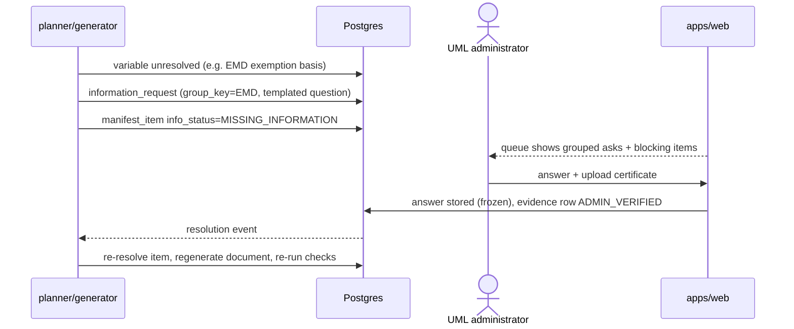

# Tender response & compliance — system architecture (§27 C)

**Status:** proposed, 2026-10-02 · design only · **Decision owner:** human
**Reads with:** `DATA_MODEL.md` (entities named here are defined there), `IMPLEMENTATION_PLAN.md`

## 0. Shape in one paragraph

No new service. The pipeline runs inside `services/engine` as resumable job stages
(`app/jobs.py` + Cloud Tasks `app/tasks.py`, migration 0048), reads and writes Supabase Postgres
under workspace RLS, and gains one thing it has never had: **retained originals in Supabase
Storage** plus a page text store. `apps/web` gets screens for the package, the manifest, the
missing-information queue, the vault admin and the pack review. Every stage is deterministic
unless this document names a model tier for it, and no model output writes a status.

```
apps/web (Next.js) ──BFF route handlers──▶ services/engine (FastAPI)
                                             ├─ app/ (routes, services)
                                             ├─ app/deterministic/ (gates, checks — 100% branch)
                                             ├─ pipeline/ (model calls via one client)
                                             └─ jobs (Cloud Tasks → /internal/jobs/run)
Supabase: Postgres+RLS · Storage (private bucket, NEW) · Auth
services/gem-connector: public GeM pages only (G-8); parser logic PORTED into engine (§2.2)
```

## 1. Model routing (decided 2026-10-02 — §H1)

**Today:** one client, `services/engine/pipeline/client.py`, Gemini only (`GEMINI_MODEL`, default
`gemini-2.5-flash`), structured output, one retry, timeout, `ModelError` → deterministic fallback.
`CLAUDE.md`'s stack table says "Claude API — sonnet/haiku"; the code disagrees. TypeSafe Jev is
used only for feed relevance (`pipeline/jev.py`).

**Decided (delegated by the human to the orchestrator):** keep the one-client contract and add a
`tier` argument — not a second client.

| Tier | Model | Used for | Requirement |
|---|---|---|---|
| `reasoning` | `claude-opus-5` — adaptive thinking, effort `high`, server-side refusal fallbacks `fallbacks: "default"` with beta `server-side-fallback-2026-07-01` | page-role classification of ambiguous pages, requirement extraction, manifest proposal, conflict detection between clauses, evidence-match proposals, Type C fact-gathering plan, submission planning, variant ties, compliance adjudication | strongest available; output schema-allowlisted; never writes a status |
| `drafting` | `claude-haiku-4-5` | Type C prose only (technical compliance statement TMP-013, non-CIL cover letters) and other routine wording — never compliance decisions | cheap; may only use values handed to it; every number it emits must be a transclusion token |
| none (deterministic) | — | everything else: GeM bid-doc parse, template fill, Type D fill, validity, every compliance check, status roll-ups, pack assembly | default |

Env: `TC_MODEL_REASONING=<provider>:<model>`, `TC_MODEL_DRAFTING=<provider>:<model>` (the names
go into `.env.example` when M-b/M-k add them); missing → named startup error (CLAUDE.md "fail
fast"). `ai_decisions.model_id` + `prompt_sha` record which one ran. `pipeline/client.py` gains a
tier-routed Claude path (Python `anthropic` SDK) behind the existing single model module;
existing Gemini callers (feed relevance, KB classifier, current extractor/drafter) are unchanged
until a parity eval says otherwise. **Measured, not assumed:** M-j's harness additionally runs
`claude-sonnet-5` against Opus for high-volume per-page extraction, comparing cost per tender
against mandatory recall — the cheaper model is adopted only if the eval shows no recall loss; no
pricing is asserted here, M-j/M-b report the measured figures. Any switch re-runs `/evals` for
every affected component; the relevance-cache lesson in `known-pitfalls.md` (model identity must
be in any cache key) applies to `criteria.requirement_hash`.

## 2. Pipeline, stage by stage

Legend: **D** deterministic · **R** reasoning tier · **W** drafting tier · **H** human.

### 2.1 Upload → `files`, `document_versions` (D)

- Input: multipart upload, inbound email (`app/inbound_routes.py`, HMAC), or public GeM PDF.
- Accept PDF, XLSX/CSV (today) **plus DOCX, MSG, JPG/PNG** (today rejected at
  `app/ingest.py:185` `UNSUPPORTED_FORMAT`). ZIP-bomb guard already exists for Office zips.
- Store bytes in Storage at `<workspace_id>/<sha256>` before any parsing (today the bytes live
  only in a `BackgroundTasks` closure — `known-pitfalls.md` "deferring work over a document
  nobody stored").
- Form fields bind with `Annotated[str, Form()]` (the B1 defect in the 2026-09-15 audit).
- Guardrails: G-6 (content is data), per-workspace rate limit, size cap.

### 2.2 Parser → `pages`, `page_roles`, `tender_documents` (D, then R for leftovers)

1. Text: pypdf/`pdftotext -layout`; OCR (`app/ocr.py`, tesseract) when a page has <40 chars;
   python-docx incl. **tables** (the audit's B5: tables were dropped); openpyxl; `extract-msg`.
   Page text persisted (`pages`), so OCR is paid once and every later stage can re-read.
   Raise the 60-page OCR budget to a per-package budget with a logged truncation.
2. **Classify by content, never filename.** Rules first: GeM bid-document markers (bid-number
   header, "Bid Details" section labels as in `gem-connector/app/document.py`), GTC version
   string, Integrity Pact heading, UML letterhead/signature block → `seller_*`. Leftover pages
   → R tier, page-level, schema = enum of `page_roles.role`. Why: "ATC.pdf" was UML's bundle in
   7/12 tenders, `Steel policy.pdf` an affidavit, a hybrid SAIL PDF (`03_initial_findings.md`
   §E1; SAIL friction #1). A seller page inside a "tender" upload is still useful: it is a
   candidate `evidence` row for the vault, routed to the admin queue, never auto-trusted.
3. **GeM bid document: deterministic parse.** 321/632 golden requirements (51%) come from the
   GeM bid document, whose template is stable across the 10 GeM tenders that retained it
   (ONGC's archive lacks it). Port the label-based parser in `services/gem-connector/app/document.py` (turnover, EMD, ePBG, MSE/startup relaxation,
   experience years, est. value) into `services/engine/app/deterministic/gem_bid_doc.py` and
   extend it to: bid end/opening, schedules + quantities, "Additional Doc" upload slots,
   buyer-added terms, embedded ATC text. Port (copy) rather than call the connector: the
   connector runs in `asia-south1` and must not receive client documents; both packages are
   named `app` (pitfall). A parity test runs both parsers on the connector's golden fixtures.
4. Output: `tender_documents` with `doc_family`, active `document_versions`, `tenders.response_status=PARSED`.

Failure: unreadable page → `pages.legible=false` → surfaced as illegible-page blocker
(`deterministic/submission.py` already counts them). Model error → page stays `unclassified`
and goes to a human; never dropped.

### 2.3 Requirement extractor → `criteria` (D + R, H confirms)

- D: GeM bid-doc fields from 2.2 become criteria directly with exact page anchors.
- R: remaining `buyer_requirement` pages (ATC, tech spec, buyer formats, Integrity Pact) — today
  `pipeline/extractor.py` does one call per page with no cross-page context. Change: call per
  **section** (heading-bounded run of pages) with the v1.1 schema from
  `PHASE2_BRIEF` (`requirement_type`, `quote_fidelity`, `source_excerpt`, flags, stage).
- D post-processing: quote verification — ≥90% of words and 100% of numbers must occur on the
  cited page range (the corpus verifier's rule); failing rows are marked `REQUIRES_REVIEW`, not
  dropped. `risk_level` derived from type+mandatory. Duplicate detection (same normalised text,
  different document) → `duplicate_of`. Technical numeric parameters → `spec_parameters`
  via the existing `pipeline/spec_extractor.py` + `spec_match.py` path.
- R: conflict proposal between clauses → `requirement_conflicts` (detected_by=model, status open).
- H: verify queue (`VerifyQueue.tsx`) shows the **retained source page** beside the extraction
  (audit P1 "verification asks users to approve the extraction itself").
- Gate: lock (`deterministic/lock.py`) extended — no lock while any buyer page is unclassified,
  illegible without acknowledgement, or a conflict is open.
- G-6: extractor has no tools; output schema-allowlisted; tender text never parameterises a fetch.

### 2.4 Submission planner → `submission_manifests`, `manifest_items` (D first, R proposes, H locks)

- D rules produce the obligatory items: every criterion with `required_document` or
  `prescribed_format_ref` → an item; the UML core kit (factory licence, GST, PAN, turnover cert,
  BIS for the relevant IS standard) when criteria demand identity/statutory proof; every
  `PORTAL_ACTION` (EMD exemption claim, ePBG) and `ACCEPTED_BY_PARTICIPATION` criterion as a
  file-less tracked item. Folder slot by `doc_kind`.
- R groups criteria into documents where the buyer does not prescribe one, and proposes
  `response_type`; each proposal is an `ai_decisions` row with a reason. D rejects any proposal
  that leaves a mandatory criterion unanswered (coverage is computed, never asserted).
- H: UML reviewer locks the manifest. Lock records the requirement snapshot hash.

### 2.5 Historical retrieval (D + R, guidance only)

- Source: `past_bids`/`answers` (0027) for prose; for UML, the per-requirement-type prior from
  the analysed corpus (which document types and template families answered which requirement
  types for which buyer family). Lexical retrieval exists (`pipeline/retrieval.py`).
- Output: `evidence_bindings` with `proposed_by='historical'` and `manifest_items` suggestions,
  labelled "used in <tender>, <date> — verify". **It can never set `state=confirmed`, never fill
  a value, never mark COMPLIANT.** Why: historical documents carry the copy-forward errors
  (6 incidents) and a stale GTC excerpt (MIP-012) — reuse without re-checking is how those happened.

### 2.6 Company vault (D, H verifies)

- Lookup order per variable: current tender field → `company_facts` (DOCUMENTARY/ADMIN_VERIFIED,
  valid on bid end) → confirmed `evidence` → historical (suggest only) → `information_requests`.
- Validity computed against bid end and, separately, against the expected contract-performance
  end (delivery period from the bid document). Sensitive facts (GSTIN/PAN/bank) are filled
  deterministically into documents but never sent to a model and masked in UI/logs.
- Renewal chains (`supersedes_evidence_id`): a newer BIS endorsement replaces the older one in
  every *unapproved* manifest; approved packs keep what was signed.

### 2.7 Missing-information manager → `information_requests` (D)

- Trigger: any variable or manifest item that resolves to nothing. Questions are format strings
  over typed gaps, grouped by `group_key` (one ask for "all EMD evidence", not eleven); templates
  seeded from the 16 patterns in `missing_information_patterns.json`.
- Answer → creates a `company_facts`/`evidence` row (ADMIN_VERIFIED only if answered by an admin)
  → re-runs the affected manifest items' resolution → item `info_status` recomputed.
- Vault-level asks are raised proactively, e.g. FY2025-26 turnover certificate (the FY24-25 one
  was still being filed a year later — `vault_and_evidence_summary.md`), NABL renewal.

### 2.8 Template engine (D; R only to *propose* a variant when rules tie)

- Type A: no template; attach the evidence file's page range.
- Type B: approved `template_variants` .docx rendered with python-docx; variables from §2.6 only.
  Variant chosen by `selection_rule`; when rules tie, R proposes with a reason, a human confirms
  the first time, and the choice is logged (`variant_selected`). Branch variables
  (TMP-003 land border) default from a fact (`country_of_incorporation`), so the wrong branch
  used in ECL-GEM-2025-B-6119954 is unreachable.
- Type D: fill the buyer's own file. DOCX → fill content controls/particular blanks found by
  label match; PDF → do **not** edit; generate a filled-particulars cover sheet + flag the item
  `REQUIRES_REVIEW` for a human to fill and upload. Never substitute a UML template for a
  prescribed format (MIP-007).
- Type C: see 2.9.

### 2.9 Document generator (D for B/D; W for C, under cite-or-flag)

- Type C prose: W tier receives only the criterion text, the confirmed facts/evidence chunks and
  structured `spec_parameters`; numbers render as transclusion tokens (B-FR3) from facts or the
  schedule; `deterministic/drafting.py::validate_draft` flags uncited sentences; a placeholder
  block replaces anything unsupported. No "enclosed/attached" claims (pitfall).
- Every output writes `generated_documents.values` + `statement_sources` (field roles) and a
  `content_hash`. Rendering to PDF: LibreOffice headless (`soffice --headless --convert-to pdf`)
  inside the engine image, run as a job stage (§H6 decided 2026-10-02, delegated to the
  orchestrator; ceiling is image size/cold start — split into its own service only if measured
  cold start or memory hurts).

### 2.10 Compliance validator → `compliance_runs/results` (D only)

Runs the §4 catalogue over the locked manifest + generated documents. Bound to the manifest
content hash. Status roll-up per requirement: any CONFLICT → CONFLICT; else any MISSING_DOCUMENT;
else MISSING_INFORMATION; else REQUIRES_REVIEW; else PARTIALLY_COMPLIANT if some bound items
incomplete; else COMPLIANT; NOT_APPLICABLE only with a stored reason.

### 2.11 Human review → approval (H)

UML review then approval chain (`app/authz.py`: review/compliance/legal/final, segregation of
duties). Approvals bind to `content_hash` (0043 semantics). Signatures/stamps/notarisation are
human attestations per item. Waivers need admin + reason, logged.

### 2.12 Export → final pack (D)

A ZIP, filenames generated from the manifest (never the source filename — MIP-014):

```
01_Tender_Analysis/   requirement register (XLSX), conflicts, bid summary
02_Compliance_Matrix/ matrix (XLSX + PDF) from compliance_results
03_Eligibility/       turnover, experience, OEM/BIS evidence
04_Technical/         TMP-013 statements, data sheets, spec compliance
05_Commercial/        price-bid format placeholder (UML fills), EMD/ePBG notes
06_Declarations/      Type B fills (LOB, banning, land border, price fall, local content…)
07_Buyer_Formats/     Type D fills and to-fill-by-hand items
08_Company_Evidence/  Type A attachments (one copy each — no 4× scanned PO)
09_Signatures_Checklist/ what needs sign/stamp/notary, by whom
10_Audit_Trail/       ai_decisions + audit_events export, statement_sources trace
```

Gate: `export_gate.py` extended — no FINAL_PACKAGE while any blocking result is open on the
current run. Upload to GeM is manual (G-1). A human records "submitted" afterwards.

## 3. Guardrail map

| Guardrail | Where enforced |
|---|---|
| G-1 / G-8 no portal credentials, no authenticated acquisition | no portal write path exists; `portal_fetch` limited to public URLs via `GuardedFetcher`; export ends at a ZIP |
| G-6 tender text untrusted | extractor/classifier have no tools; allowlisted schemas; R output never selects a code path that writes a status; injection cases in evals |
| Cite-or-flag (G-5) | `statement_sources` + `validate_draft`; check C15 |
| Deterministic decides (§2.4) | all checks in `app/deterministic/`; schema-discipline test refuses outcome-shaped fields in model schemas |
| ET-6 tenancy | `workspace_id` + RLS on every table; Storage path prefix; no cross-workspace dedup |
| Secrets/sensitive values | env only; sensitive facts masked, never in prompts or logs |

## 4. Compliance-check catalogue

All deterministic. "Incidents" = what the check would have caught in the 12-tender corpus.

| Code | Check | Det.? | Data source | Historical incidents |
|---|---|---|---|---|
| C01 | Tender identity: every `current_tender_ref` value (bid no., buyer, buyer family) equals this tender | yes | `generated_documents.values`, reused evidence page text, tender meta | MCL banning + local-content (stale bid nos.), ONGC API-9A bundle p3-4 (other bid), NMDC-7682164 lowest-price cert ("Coal India") — `template_discovery_report.md` |
| C02 | Signature/declaration date within [bid issue, bid end or extended end] | yes | values + tender dates + corrigenda | ECL-7055356 `LOCAL.docx` dated before issue; SAIL undertakings dated a day after deadline (MIP-016) |
| C03 | Evidence valid at bid end | yes | `evidence.valid_to`, `company_facts.valid_until` | **0 incidents** in corpus (`vault_and_evidence_summary.md`) — kept because cost is zero |
| C04 | Evidence valid through expected performance period (warning → REQUIRES_REVIEW) | yes | delivery period, validity | NABL TC-5016 (ECL-7055356), API-9A 29-Jul-2026 (ONGC) — MIP-015 |
| C05 | Declaration variant matches facts (land border branch, OEM vs trader, MSE claim) | yes | variant `allowed_values` + facts | ECL-6119954 land-border "is from" |
| C06 | Prescribed buyer format used where the criterion names one | yes | `prescribed_format_ref` vs item `response_type` | MIP-007 (3) |
| C07 | Every mandatory bid-stage criterion has a manifest item with a file or a file-less reason | yes | criteria × manifest_items | NOT_FOUND gaps such as SAIL proprietary certificate |
| C08 | Signature/stamp/notarisation required → human attestation recorded | partly (presence of attestation; the signature itself is not verifiable) | criteria flags, item attestations | 51 sig / 16 stamp / 1 notary requirements; Integrity Pact unsigned copy (TMP-011) |
| C09 | No unfilled variables, template markers or placeholders | yes | rendered text, `drafting.template_placeholders` | template skeleton risk in all Type B families |
| C10 | Figures consistent across the pack and with the vault (turnover, net worth, local-content %, quantities) | yes | `values` grouped by fact_key | single local-content % per pack (ONGC 50% vs a stray older declaration) |
| C11 | No-deviation statement vs any declared deviation | yes | LOB variant + items of kind deviation | ECL-7055356 REQ-065; MIP-011 (6) |
| C12 | EMD-exemption basis exists in *this* bid's GTC version | yes (text match on retained GTC pages) | GTC pages, claimed category | ECL-7055356 turnover ≥ Rs 500 Cr category absent from GTC v1.28 (MIP-012) |
| C13 | No open `requirement_conflicts` | yes | conflicts table | SAIL single vs two-envelope; Oil India TPI; MOIL section citation |
| C14 | Copied old details: historical evidence page carries a *different* tender's identifiers where the field role is current-tender | yes | `statement_sources.field_role` | distinguishes the ~8 legitimate past-contract numbers in provenness evidence from real errors |
| C15 | Unsupported material fact: any non-narrative statement without a source | yes | `statement_sources` | target 0% |
| C16 | Pack file naming/content: no file whose classified role disagrees with its slot | yes | `page_roles` vs pack folder | 7/12 "ATC" bundles (MIP-014) |
| C17 | Duplicate attachments (same evidence page-hash twice) | yes | evidence sha + page range | ECL-6929440 one PO scanned 4× |

## 5. Corrigenda

A new buyer file whose content classifies as corrigendum/modified annex/clarification creates a
`document_versions` row (`supersedes_version_id` when the family matches). Re-extraction runs on
the new version only; a deterministic diff pairs old and new criteria by normalised clause key:
changed → new criterion with `supersedes_id`; contradictory without a clear replacement →
`requirement_conflicts(kind=corrigendum)` = `POTENTIAL_REQUIREMENT_CONFLICT`. Everything
downstream that cites a superseded criterion becomes `stale`; approvals on stale documents stop
counting (hash mismatch); `response_status` returns to `REQUIREMENTS_EXTRACTED`. Deadline
extensions update tender dates and re-run C02. **The corpus has one modified annex
(ECL-7055356 Annexure-X) and no formal corrigendum**, so the M-i acceptance tests are synthetic.

## 6. Sequence diagrams

### 6.1 New tender, end to end

```mermaid
sequenceDiagram
  actor U as UML user
  participant W as apps/web
  participant E as engine API
  participant J as job runner
  participant S as Storage
  participant M as model client
  participant DB as Postgres
  U->>W: upload package (PDF/DOCX/XLSX/MSG)
  W->>E: POST /api/tenders/ingest (multipart)
  E->>S: put bytes (workspace/sha256)
  E->>DB: files, tender, job(kind=ingest)
  E-->>W: 202 job id
  J->>DB: pages (text/OCR), page_roles via rules
  J->>M: classify leftover pages (reasoning)
  M-->>J: roles + confidence
  J->>DB: GeM bid-doc criteria (deterministic parse)
  J->>M: extract requirements per section (reasoning)
  J->>DB: criteria + quote verification + conflicts
  U->>W: confirm requirements, lock
  J->>DB: manifest (rules) + ai_decisions (proposals)
  J->>DB: resolve variables from vault; information_requests for gaps
  U->>W: answer requests (admin)
  J->>DB: render Type B/D, draft Type C (drafting tier), statement_sources
  J->>DB: compliance run C01-C17
  U->>W: review, attest signatures, approve (hash-bound)
  E->>S: build ZIP pack 01..10
  U->>W: download pack, upload to GeM by hand
```

### 6.2 Corrigendum arrival

```mermaid
sequenceDiagram
  actor U as UML user
  participant E as engine
  participant DB as Postgres
  participant M as model client
  U->>E: upload corrigendum or forward buyer email
  E->>DB: files + document_versions(supersedes_version_id)
  E->>M: extract requirements from new version (reasoning)
  E->>DB: deterministic diff old vs new criteria
  alt clause replaced
    E->>DB: new criterion supersedes_id; old marked superseded
  else contradictory
    E->>DB: requirement_conflicts kind=corrigendum (open)
  end
  E->>DB: mark dependent items/docs stale; response_status=REQUIREMENTS_EXTRACTED
  E->>DB: approvals with old content_hash stop counting
  E-->>U: notify: N items stale, M conflicts to resolve
```

### 6.3 Missing-information round trip



## 7. Evaluation harness (uses the 12 analysed tenders)

**Inputs per tender:** only buyer-side pages (`page_roles` buyer_* per the golden manifest in
`tender_analysis/_text/<slug>/manifest.json`), plus a **vault snapshot as-of the bid end date**
(facts whose `valid_from`/first-seen precede bid end) — otherwise facts learned from later
tenders leak into earlier ones. UML's submitted files are hidden.

**Golden:** `requirements/*.json` (632), `submission_documents/*.json` (307), `mapping/*.json`,
`template_candidates.json` (TMP family per instance), `missing_information_patterns.json`, and
the copy-forward table. Stored outside the repo (both directories are gitignored) and loaded by
path from an env var; the harness code and *synthetic* cases live in `services/engine/evals/`.

| Metric | Definition | Target |
|---|---|---|
| Mandatory requirement recall | golden `mandatory=true`, `stage=bid` rows matched by a prediction on the same page range with ≥0.8 token overlap | ≈1.00 (gate ≥0.98) |
| Requirement recall / precision | all rows, same matcher; precision on predictions | ≥0.90 / ≥0.80 |
| Submission document recall | golden documents with origin UML-generated / reusable / tender-specific / buyer-format-filled, mapped to normalised `doc_kind`, found in the predicted manifest | ≥0.90 |
| Evidence mapping accuracy | predicted confirmed-eligible bindings vs golden `evidence_documents` resolved to `EV-*` ids | ≥0.85 |
| Template selection accuracy | predicted family+variant vs `template_candidates.json` instances | ≥0.90 |
| Missing-info detection | predicted asks vs golden MIP occurrences of kind `information_request` that were knowable at bid time | ≥0.80 recall |
| Copy-forward detection | C01/C02/C05/C14 on the archived submitted files: 6 known incidents caught, 0 false positives on past-contract references | 6/6, 0 FP |
| Unsupported material fact rate | statements with no source / all non-narrative statements | 0% |

Oracle discipline (`CLAUDE.md` verification rules): the golden set was produced by analysis
agents, not by UML, and carries known defects (quote suspects explained per report; ONGC has no
GeM bid document; SAIL is not GeM). Before trusting a score, read every disagreement on two
tenders; a matcher that cannot distinguish a paraphrase from a miss is tested against
deliberately corrupted predictions first. Split: develop on 6 tenders, hold out 6
(at least one per buyer family: ECL/MCL, NMDC, Oil/ONGC, MOIL/UCIL, SAIL). With 12 tenders and
2 awarded, every number is a smoke signal, not a release-grade measurement — mark `"starter": true`.
