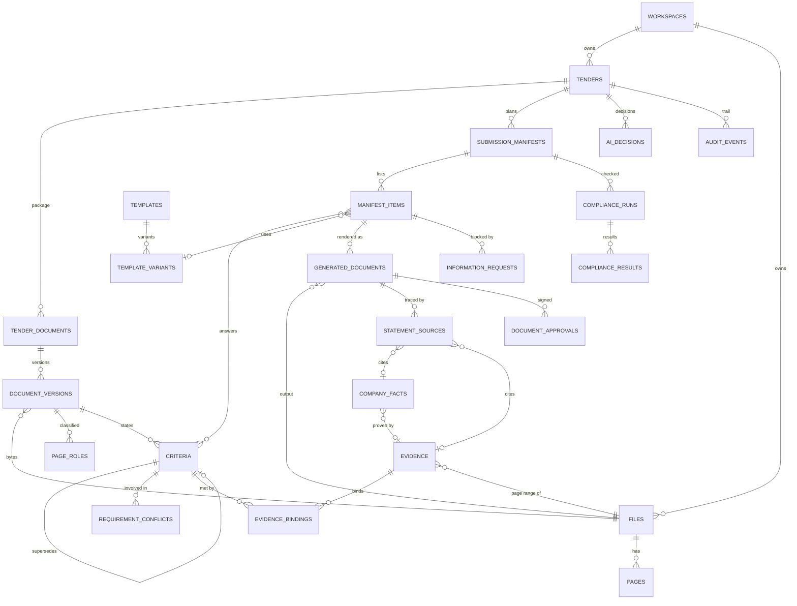

# Tender response & compliance — proposed data model (§27 B)

**Status:** proposed, 2026-10-02 · design only — no migration written · **Decision owner:** human
**Customer driving it:** Usha Martin Limited (UML), wire-rope manufacturer, mostly GeM bids
**Companions:** `ARCHITECTURE.md` (pipeline), `IMPLEMENTATION_PLAN.md` (milestones)

## 0. What this model must make true

1. **Nothing is invented.** Every value that reaches a generated document resolves, in order, to:
   the current tender → a verified company-vault fact → approved reusable evidence → historical
   evidence (guidance only, never authority) → an answer from the UML administrator. If none
   exists the value is `MISSING_INFORMATION`, rendered as a visible placeholder.
2. **Structured first, documents second.** Tender → Requirement → Submission Manifest item →
   Generated/attached document → Evidence. Word/PDF files are *outputs* of these rows.
3. **Traceable both ways.** statement → requirement → clause (page) → fact → evidence → source
   file (sha256 + page). And requirement → which manifest item answers it.
4. **Deterministic code decides.** Every status column below is written by deterministic code or
   a named human; no model writes a status, a validity, or a compliance verdict (PRD §2.4,
   `tests/test_schema_discipline.py`).

Tenancy: every new table carries `workspace_id uuid not null references workspaces(id)` and an
RLS policy `workspace_id = public.current_workspace_id()` (migration 0010 renamed the tenant
column; 0048 `jobs` is the current house shape). Writes go through the engine with the
service role and mirror the same scoping in code (`app/auth.py`); never from a request body
(ET-6). Exceptions are named per entity.

## 1. What the historical corpus says the model must hold

Measured in `tender_analysis/` (12 tenders, 632 requirements, 307 submitted documents):

| Observation | Source | Consequence for the model |
|---|---|---|
| 51% of requirements (321/632) sit in the GeM bid document; 117 in tech specs, 71 in ATCs | `requirements/*.json` `source_document` | Requirements need a page anchor into a *retained* file, not just text |
| 79 rows are `condensed_table`, 32 `summary`; tables are linearised | same, `quote_fidelity` | Requirement keeps `quote_fidelity` + `source_excerpt` |
| 82 requirements prescribe a buyer format; 51 need signature, 16 stamp, 1 notarisation | same | Requirement carries those flags; manifest items inherit them |
| 104 requirements are conditional (MSE relaxation, trader→OEM) | same | `conditional` + `condition`, and NOT_APPLICABLE needs a reason |
| 23 `duplicate_of`, 3 `conflicts_with`, 8 `POTENTIAL_REQUIREMENT_CONFLICT`, **0 `superseded_by`** | same | Conflict table is needed now; corrigendum lineage is designed but **untested by this corpus** |
| Filenames lie: "ATC.pdf" is UML's own bundle in 7/12 tenders; `Steel policy.pdf` is a notarised affidavit; a filename-vs-bank mismatch | `03_initial_findings.md` §E1, `vault_and_evidence_summary.md` #1 | Document role is a *content* classification stored per page range, never inferred from a filename |
| One PDF can be buyer template + UML's filled answer (SAIL pp1-6 vs pp7-11) | `reports/SAIL_CD-…md` friction #1 | Role is per **page range**, not per file |
| The dedup unit is the certificate inside a bundle (15 distinct bundle hashes, same certificates) | `vault_and_evidence_summary.md` | Evidence = file + page range; bundles are containers |
| 53 company facts, 3 UNCONFIRMED; one digit unresolvable from the scan (incorporation year) | `company_facts.json` | Facts carry `verification_status`; UNCONFIRMED never fills a document |
| 37 evidence items: 20 Type A, 14 "A*" (reusable but renewed per period), 2 tender-specific | `evidence_library.json` | `reuse_class` has an A* value with validity tracking |
| 13 template families, mean similarity 0.01–0.86 — families with variants, not single templates | `template_candidates.json` | Template → variant, variant selection is a logged decision |
| 6 copy-forward incidents (stale bid no., wrong buyer, wrong branch, wrong date) | `template_discovery_report.md` table | Every generated value records its provenance so a check can compare it |
| 16 `tender_specific_fields` marked incorrect — ~8 are *past contract numbers* in provenness evidence, which are correct to differ | `submission_documents/*.json` | Fields need a role: `current_tender_ref` vs `historical_ref` |

## 2. Entity catalogue

Types are Postgres. `uuid pk` and `created_at timestamptz` are implied on every table.

### 2.1 `files` — NEW (one store for every byte we keep)

Purpose: retained originals. Today nothing is stored (`DOCUMENTS_BUCKET` is read by no code;
`app/tenders.py:362` says so). Every tender document, evidence file and generated output is a row.

| Field | Type | Notes |
|---|---|---|
| workspace_id | uuid | RLS |
| storage_path | text | `<workspace_id>/<sha256>` in a private Supabase Storage bucket; content-addressed so a re-upload dedups |
| sha256 | text | unique per workspace |
| filename_original | text | kept for display/audit only — never used for classification |
| mime, byte_size, page_count | text, bigint, int | |
| source | enum `upload\|inbound_email\|generated\|portal_fetch` | `portal_fetch` only for public GeM pages (G-8) |
| uploaded_by | uuid | |

RLS: standard. Storage bucket policy mirrors it (path prefix = workspace). Residency of this
bucket is a human decision (IMPLEMENTATION_PLAN §H).

### 2.2 `pages` — NEW (page text store)

| Field | Type | Notes |
|---|---|---|
| file_id | uuid → files | |
| page_no | int | 1-based; xlsx/docx/msg → page 1 (as `_text/*/manifest.json` does) |
| text | text | `pdftotext -layout` or OCR output |
| method | enum `text\|ocr\|docx\|xlsx\|csv\|msg` | |
| chars, ocr_confidence | int, numeric | `ocr_confidence` null for `text` |
| legible | bool | replaces the per-tender `tenders.illegible_pages` jsonb (0044) as the source of truth |

Unique `(file_id, page_no)`. Populated from `tender_analysis/_text/<slug>/manifest.json` for the
eval harness only, never into production (§H decision).

### 2.3 `tender_documents` + `document_versions` — NEW (package + corrigendum lineage)

`tender_documents` is the logical document ("Technical Specification", "ATC", "Annexure-X");
`document_versions` is each physical arrival of it.

| tender_documents | Type | Notes |
|---|---|---|
| tender_id, workspace_id | uuid | |
| doc_family | enum `bid_document\|atc\|gtc\|tech_spec\|boq\|buyer_format\|integrity_pact\|corrigendum\|clarification\|correspondence\|other` | content-classified |
| title | text | read from the document, never the filename |

| document_versions | Type | Notes |
|---|---|---|
| tender_document_id | uuid | |
| file_id | uuid → files | |
| version_no | int | 1 = original |
| supersedes_version_id | uuid null | corrigendum / modified annex (e.g. ECL-7055356 `Modified Annexure-X.pdf`) |
| received_at, received_via | timestamptz, enum | |
| status | enum `active\|superseded` | deterministic: newest active per document |

`page_roles` (child of a version): `page_from, page_to, role enum
buyer_requirement|buyer_format_blank|buyer_format_filled|seller_evidence|seller_bundle|correspondence|portal_artifact,
classified_by enum rule|model|human, confidence`. This is how one SAIL PDF holds both a buyer
template and UML's filled answer, and how a 33-page "ATC.pdf" is recognised as UML's bundle.

Extends: `tenders` keeps `id`, metadata, `illegible_pages` (deprecated → `pages.legible`).
Migration: additive; existing tenders get no `tender_documents` (no originals exist to point at)
and say so on screen rather than back-filling fakes.

### 2.4 Requirement — EXTENDS `criteria` (0001, 0045, 0042)

Decision: **extend `criteria` in place**, do not create a parallel table. The lock gate
(`deterministic/lock.py`), verify queue, matrix, readiness and eligibility already key on
`criteria.id`; a second requirement table is the "two implementations of one rule" pitfall.

Added columns (all nullable for old rows):

| Field | Type | Golden-set source field |
|---|---|---|
| document_version_id | uuid → document_versions | `source_document` |
| anchor_page_end | int | `page_end` |
| section | text | `section` |
| requirement_type | enum of the 27 v1.1 values | `requirement_type` (existing `category` kept as a coarse projection) |
| quote_fidelity | enum `verbatim\|reflowed\|condensed_table\|summary` | `quote_fidelity` |
| source_excerpt | text | `source_excerpt` (required when fidelity ∈ condensed_table, summary) |
| mandatory | bool null | `mandatory` (null = text unclear; existing `requirement_level` stays) |
| conditional, condition | bool, text | `conditional`, `condition` |
| applies_to_schedules | text[] | `applies_to_schedules` |
| required_document | text | `required_document` |
| signature_required, stamp_required, notarisation_required | bool null ×3 | same |
| prescribed_format_ref | text | `prescribed_format_ref` (points to a `tender_documents` row when retained) |
| submission_stage | enum `bid\|technical_evaluation\|post_award\|delivery` | `submission_stage` |
| risk_level | enum `high\|medium\|low` | `risk_level` — **derived deterministically** from type+mandatory, model may propose |
| duplicate_of | uuid → criteria | `duplicate_of` |
| supersedes_id | uuid → criteria | inverse of golden `superseded_by` |
| lifecycle | enum `active\|superseded\|withdrawn` | deterministic |

Corrigendum rule: a locked criterion is never edited. A corrigendum yields a **new row** with
`supersedes_id`; the old row becomes `superseded`; every manifest item, binding, generated
document and approval that cites the old row is invalidated (ARCHITECTURE §5). The row lineage
*is* the RequirementVersion — no separate version table.

#### `requirement_conflicts` — NEW

`requirement_a, requirement_b uuid; kind enum intra_document|cross_document|corrigendum|
bidder_vs_buyer; detected_by enum rule|model|human; status enum open|resolved|accepted_risk;
resolution_note text; resolved_by uuid`. Rendered as `POTENTIAL_REQUIREMENT_CONFLICT`. Seeded
cases: SAIL single-part vs two-envelope (SAIL039-REQ-002/031), Oil India TPI not-applicable vs
Annexure-IV (OIL7431083-REQ-016/027/043), ECL-7055356 no-deviation vs Deviation Letter
(REQ-065). An `open` conflict blocks Approval (compliance status `CONFLICT`).

### 2.5 `company_facts` — NEW, becomes the vault's source of truth

Purpose: one fact per row with provenance; typed EAV like `spec_parameters` (0029) so a new fact
needs a registry entry, not a column.

| Field | Type | Notes |
|---|---|---|
| fact_key | text | from `deterministic/fact_keys.py` registry (e.g. `legal_name`, `turnover_fy`, `bis_licence`, `factory_licence`, `dgms_approval`, `local_content_pct_default`, `authorised_signatory`) |
| qualifier | text null | FY label, standard (`IS 3626:2024`), bank, plant |
| value_text, value_num, value_date | text, numeric, date | one used per kind |
| unit | text null | `INR_cr`, `%`, `m` |
| sensitive | bool | GSTIN/PAN/bank/IFSC → stored encrypted-at-rest column, masked in UI and logs, never sent to a model |
| evidence_id, source_page, source_quote | uuid → evidence, int, text | provenance; quote redacted when `sensitive` |
| valid_from, valid_until, as_of | date ×3 | `as_of` for point-in-time facts (turnover) |
| verification_status | enum `DOCUMENTARY\|ADMIN_VERIFIED\|UNCONFIRMED\|REJECTED\|LEGACY_PROFILE` | only DOCUMENTARY/ADMIN_VERIFIED may fill a document |
| verified_by, verified_at | uuid, timestamptz | admin verification UI writes these |
| conflicts_with | uuid[] | e.g. API-9A expiry 26 vs 29 July (CF-109) |

Populated from: `company_facts.json` (53 facts; `fact_id`, `category`→`fact_key`, `value`,
`source_document/page/quote`, `valid_from/until`, `verification_status`, `conflicts`).

Extends/replaces: `vendor_profiles`, `profile_financials`, `certifications`, `experience_records`
(0002). Migration: (1) create `company_facts`; (2) backfill from the typed tables with
`verification_status='LEGACY_PROFILE'`; (3) rewrite `db.get_profile_context` to read facts, pinned
by a parity test that `deterministic/facts.py::decide_requirement` returns identical verdicts on
both sources; (4) typed tables become read-only views; (5) drop after one release. Two writers to
one fact is the drift pitfall in `known-pitfalls.md` (engine vs RLS) — hence views, not copies.

### 2.6 `evidence` — EXTENDS `library_documents` (0004)

Decision: extend rather than replace, because retrieval, expiry hard-exclusion and the library
screen already read it. Added columns:

| Field | Type | Notes |
|---|---|---|
| file_id, page_from, page_to | uuid → files, int, int | a certificate *inside* a bundle is its own evidence row |
| issuer, subject | text | |
| reuse_class | enum `A\|A_RENEWED\|TENDER_SPECIFIC\|HISTORICAL_ONLY` | `A_RENEWED` = "A*" (BIS endorsements, DGMS, turnover cert) |
| valid_from (valid_to exists) | date | |
| verification_status | same enum as facts | |
| supersedes_evidence_id | uuid | renewal chain (BIS endorsement 70 → 71) |
| origin_tender_id | uuid null | for TENDER_SPECIFIC and HISTORICAL_ONLY |

Populated from `evidence_library.json` (`evidence_id`, `document_type`, `canonical_path`,
`sha256`, `reuse_class`, `valid_from/until`, `requirement_types_satisfied`). `text_content`
stays (retrieval) but is derived from `pages`, no longer the 20k-char truncation.

### 2.7 `evidence_bindings` — NEW (requirement ↔ evidence)

| Field | Type | Notes |
|---|---|---|
| criterion_id, evidence_id | uuid | many-to-many |
| fact_id | uuid null | when the binding is "this requirement is met by this fact" |
| proposed_by | enum `rule\|historical\|model\|human` | |
| match_basis | text | short quotes of both sides (golden `match_basis`) |
| state | enum `proposed\|confirmed\|rejected` | only `confirmed` counts toward compliance |
| confirmed_by | uuid | |

Replaces: `readiness_decisions.document_id` (0007, a single optional doc per criterion). Migration:
copy each non-null `document_id` as a `confirmed` binding with `proposed_by='human'`.
Populated (eval only) from `mapping/*.json` `evidence_documents` + `um_response_documents`
resolved through `evidence_library.json` `other_copies`.

### 2.8 `submission_manifests` + `manifest_items` — NEW (the response plan)

`submission_manifests`: `tender_id, version int, status enum draft|planned|locked|superseded,
built_from_requirement_snapshot text (hash of active criteria ids)`. A corrigendum that changes
the snapshot hash forces a new manifest version.

`manifest_items` answers the seven manifest questions:

| Question | Field | Type |
|---|---|---|
| What document? | title, doc_kind | text, enum (normalised `document_type` vocabulary from `03_initial_findings.md` appendix) |
| Why / which clause? | criterion_ids, clause_refs | uuid[], text[] (page + clause per criterion) |
| Reuse? | response_type, template_variant_id, evidence_ids | enum `REUSABLE_EVIDENCE\|UML_TEMPLATE\|TENDER_SPECIFIC_WRITING\|BUYER_FORMAT\|PORTAL_ACTION\|ACCEPTED_BY_PARTICIPATION`, uuid, uuid[] |
| Info complete? | info_status | enum `COMPLETE\|MISSING_INFORMATION\|MISSING_DOCUMENT` (deterministic) |
| Evidence? | evidence_ids | via `evidence_bindings` |
| Who signs? | signatory_fact_id, needs_signature, needs_stamp, needs_notarisation | uuid, bool ×3 (OR of the criteria flags) |
| Where in the pack? | pack_folder | enum `01_Tender_Analysis … 10_Audit_Trail` |

`PORTAL_ACTION` and `ACCEPTED_BY_PARTICIPATION` mirror the golden `response_type` values (37 + 208
rows): they are tracked items with no file, so the manifest says *why* nothing is attached.

Replaces over time: `matrix_rows` (0018, the separately editable matrix — capability-map gap 10).
The compliance matrix becomes a read model over criteria × manifest_items × compliance_results.

### 2.9 `templates` + `template_variants` — NEW

| templates | Type | Notes |
|---|---|---|
| family_code | text | `TMP-001`…`TMP-013` seeded from `template_candidates.json` |
| family_name, template_type | text, enum `A\|B\|C\|D` | A reusable evidence (no template, points at evidence), B UML standard, C tender-specific writing, D buyer-prescribed |

| template_variants | Type | Notes |
|---|---|---|
| template_id, variant_key | uuid, text | e.g. TMP-001 `cil_numbered_lob` vs `ongc_cover_letter` |
| body_file_id | uuid → files | a .docx with `{{variables}}`; for Type D, null (the body is the buyer's file) |
| variables | jsonb | `[{name, source: current_tender\|company_fact\|admin_input\|constant\|branch, fact_key?, tender_field?, allowed_values?}]` — TMP-003 `land_border_branch` has `allowed_values` and a fact-derived default |
| selection_rule | jsonb | deterministic predicates (buyer family, portal, doc family) |
| status | enum `draft\|approved\|retired` | only approved variants are selectable |
| approved_by | uuid | a UML administrator |

Type D (Integrity Pact TMP-011, buyer annexures) is never stored as a UML template: the manifest
item points at the buyer's `tender_documents` row and a `fill_map` (field → source) recorded on
the generated document.

### 2.10 `information_requests` — NEW (missing-information queue)

Generalises the `tender_clarifications` (0038) pattern inward: questions to the UML
administrator, not the buyer.

| Field | Type | Notes |
|---|---|---|
| tender_id null | uuid | null = vault-level ask (e.g. FY2025-26 turnover cert) |
| group_key | text | groups questions into one ask (e.g. all EMD items; mirrors MIP ids) |
| target | enum `fact\|evidence\|decision\|attestation` | |
| fact_key / evidence_type | text | what an answer must produce |
| question_text | text | templated from `missing_information_patterns.json` `what_the_system_should_ask_the_administrator` — never model-written |
| blocking_item_ids | uuid[] | manifest items waiting on it |
| status | enum `open\|answered\|resolved\|withdrawn` | freeze-on-answer trigger like 0038 |
| answer_text, answer_file_id | text, uuid | |
| resolution | jsonb | ids of the `company_facts`/`evidence` rows the answer created (each starts ADMIN_VERIFIED only when the answering user has the admin role) |

### 2.11 `compliance_runs` + `compliance_results` — NEW

`compliance_runs`: `manifest_id, manifest_content_hash, started_at, engine_version`. Results bind
to a hash so a stale run cannot clear a changed pack.

`compliance_results`: `run_id, check_code (C01…C17, ARCHITECTURE §4), subject_kind enum
requirement|manifest_item|generated_document|pack, subject_id, status enum COMPLIANT|
PARTIALLY_COMPLIANT|MISSING_INFORMATION|MISSING_DOCUMENT|CONFLICT|REQUIRES_REVIEW|NOT_APPLICABLE,
detail jsonb (found vs expected, page refs), waived_by, waiver_reason`. A waiver needs a reason
and an admin (the "most consequential click" pitfall). NOT_APPLICABLE requires a reason string.

### 2.12 `generated_documents` + `statement_sources` — NEW

| generated_documents | Type | Notes |
|---|---|---|
| manifest_item_id, version | uuid, int | |
| file_id | uuid → files | DOCX (and PDF render) |
| content_hash | text | sha256 of the canonical text, same idea as 0043 |
| template_variant_id | uuid null | |
| values | jsonb | every variable: `{name, value, source_kind, source_id, page}` — the copy-forward check reads this |
| model_tier, prompt_sha | text null | Type C only |
| state | enum `draft\|in_review\|approved\|stale` | `stale` set deterministically on any upstream change |

`statement_sources`: `generated_document_id, statement_idx, text, criterion_id, fact_id,
evidence_id, file_id, page, field_role enum current_tender_ref|historical_ref|company_fact|
narrative`. This is the traceability chain; a statement with no source row is an
unsupported material fact unless `field_role='narrative'` and it carries no number, date,
name or credential (existing `deterministic/drafting.py::classify_sentence` coercion applies).

### 2.13 `document_approvals` — GENERALISES `proposal_approvals` (0005, 0043)

`generated_document_id | manifest_id, stage (review|compliance|legal|final — authz.py chain),
approver, content_hash, approved_at`. An approval whose `content_hash` ≠ current is ignored
(0043 semantics). Pack-level final approval binds to the manifest content hash.

### 2.14 `ai_decisions` — NEW (append-only, beside `audit_events`)

`decision_type enum doc_classified|requirement_extracted|requirement_typed|manifest_proposed|
template_selected|variant_selected|evidence_mapped|historical_suggested|section_drafted|
conflict_detected; subject_kind, subject_id; model_tier, model_id, prompt_sha, input_hash;
output jsonb; reason text; confidence numeric; outcome enum accepted|overridden|rejected;
decided_by uuid null`. Same append-only trigger as `audit_events` (0001). Human actions stay in
`audit_events` (whose `tenant_id` column predates 0010 — note, not changed here).

### 2.15 Tender workflow status — EXTENDS `tenders`

`response_status enum UPLOADED|PARSED|REQUIREMENTS_EXTRACTED|PLAN_GENERATED|MISSING_INFO_REQUESTED|
DRAFTED|COMPLIANCE_CHECK|UML_REVIEW|APPROVAL|FINAL_PACKAGE`. Written only by a transition
function that checks preconditions (e.g. `APPROVAL` requires zero `CONFLICT` and zero
`MISSING_*` results on the current run); every transition writes `audit_events`. It moves
*backwards* on a corrigendum (to `REQUIREMENTS_EXTRACTED`).

## 3. ER diagram

## 4. Existing tables: fate summary

| Existing | Fate | Why |
|---|---|---|
| `tenders` | extend (`response_status`) | anchor of every journey |
| `criteria` | extend (§2.4) | lock gate, matrix, eligibility already key on it |
| `vendor_profiles`, `profile_financials`, `certifications`, `experience_records` | replaced by `company_facts`, kept as views for one release | provenance + validity + verification are missing |
| `library_documents` | extend into evidence (§2.6) | retrieval + expiry exclusion reused |
| `readiness_decisions.document_id` | superseded by `evidence_bindings` | one doc per criterion is too narrow |
| `product_specs`, `spec_parameters`, `tender_line_items` (0029) | unchanged, reused | schedule fit (asks 2/3) feeds technical manifest items |
| `past_bids`, `answers`, `answer_usages` (0027) | unchanged; source for Type C reuse | acceptance receipts already exist |
| `tender_clarifications` (0038) | unchanged; pattern copied for `information_requests` | outward vs inward questions differ |
| `matrix_rows`, `matrix_unmapped` (0018) | `matrix_rows` → read model, retired; `matrix_unmapped` kept as the unread-sentence denominator | gap 10 (duplicated state) |
| `proposal_sections`, `proposal_approvals` | kept for the narrative proposal; approvals pattern generalised | UML rarely needs narrative; services customers still do |
| `jobs` (0048) | extend `kind` check: `ingest`, `extract`, `plan`, `generate`, `comply`, `export` | resumable stages already built |
| `audit_events` | unchanged; `ai_decisions` added beside it | humans vs models |
| `inbound_messages`, `bid_actions` (0035) | unchanged; inbound buyer mail becomes a `document_versions` row (`correspondence` / `clarification`) | gives inbound mail a consumer |

## 5. Deliberately NOT modelled

- **GeM portal forms, uploads or credentials** (G-1/G-8). The pack is handed to a human who
  uploads it. No `portal_submission` table; a human records "submitted" as an audit event.
- **Prices, rates, margins and commissions.** Internal emails and SO worksheets carry commission
  notes (`03_initial_findings.md` E8; SAIL report anomaly 6). The price bid is a buyer format UML
  fills itself; we model that the item exists, not its numbers.
- **Digital signatures (DSC) and wet-signature verification.** We record that a signature is
  required and that a human attests it was applied; we cannot verify one.
- **Buyer-side evaluation, scoring, or award prediction** for this capability (the evaluate
  product is behind the F13 wall).
- **Internal correspondence content** (`.msg` threads between UML staff) as evidence. A `.msg`
  is ingested only when its content classifies as buyer correspondence.
- **A per-statement version table.** `generated_documents.version` + `content_hash` suffice.
- **A RequirementVersion table** — the `criteria.supersedes_id` chain is the version history.
- **Multiple legal entities per workspace.** UML is single-sourced on identity (one GSTIN, one
  factory licence, `vault_and_evidence_summary.md`). Add an `entity_id` when a group customer
  appears, not before.

## 6. Assumptions (stated, not measured)

- A1. UML will maintain the vault via an admin UI; without it every fact decays to UNCONFIRMED.
- A2. The 27-value `requirement_type` enum generalises beyond rope; it was built from 12 tenders
  from 9 buyers (`corpus_stats.md`) and may need a 28th value.
- A3. Content-addressed storage per workspace is acceptable; cross-workspace dedup is refused on
  purpose (it would make one tenant's upload observable to another).
- A4. Corrigenda arrive as new files. The corpus contains one modified annex and zero formal
  corrigenda, so §2.3/§2.4 lineage is designed from first principles, not from data.
